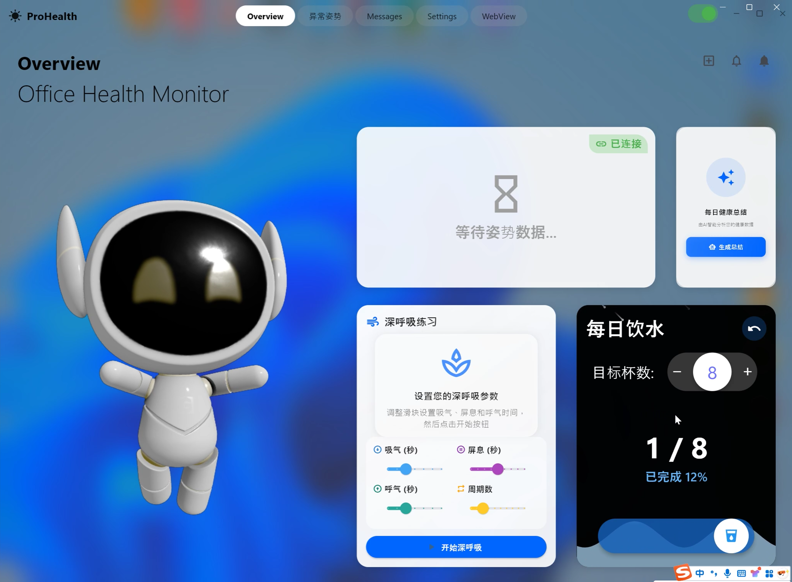
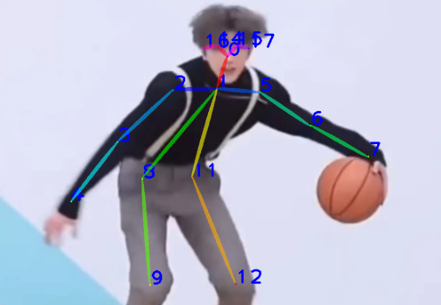

# 隐形背背佳：基于Flutter和Flask开发的坐姿检测系统

## ✨ 项目简介

本系统针对长期使用电脑的用户易出现不良坐姿、影响健康且难以自觉纠正的问题，提出了一种基于计算机视觉和自然语言处理的智能坐姿矫正系统。

- 📷 使用 OpenPose 通过摄像头实时捕捉用户坐姿
- 🤖 深度学习识别含胸驼背、脖子前倾等不良姿势
- 💬️ 使用LLM接口生成个性化矫正建议
- 📣 通过界面或语音及时反馈坐姿状态。
- 📈  记录坐姿变化趋势，持续跟踪改善效果  

🎖️ 本项目荣获 **全国大学生软件创新大赛 · 西南赛区二等奖**  
📄 已申请软件著作权  
👥 项目成员：**Ye. FS, Yang. S, Wei. J, Tian. MY, Huang. SJ**  

---

## 🖥️ 项目主界面展示



---


## 🟦🐍 编程语言

- `Dart` （前端 Flutter 框架）
- `Python` （后端 Flask 框架和算法处理）

---

## 📁 项目结构
  ```
      Repository
      ├── back/
      │   └── app/
      │       ├── advice/           # 提供坐姿建议生成逻辑
      │       ├── analyse/          # 姿态分析模块
      │       ├── openpose/         # 关键点检测模块（需放置模型文件）
      │       ├── settings/         # 配置文件管理
      │       ├── utils/            # 工具函数
      │       ├── workbench/        # 主处理逻辑
      │       ├── __init__.py
      │       └── front.py
      │   ├── config.json
      │   ├── client.py
      │   ├── run.py
      │   └── server.py
      │
      ├── front/
      │   ├── models/               # 数据模型
      │   ├── pages/                # 界面页面
      │   ├── services/             # 与后端交互服务
      │   ├── utils/                # 工具类
      │   ├── widgets/              # 自定义组件
      │   ├── how                   # 说明/文档
      │   └── main                  # Flutter 主入口文件
  ```


## 📥 依赖模型下载

`body_pose_model.pth` 可从以下链接下载，并放置在 `openpose/` 文件夹中：

👉 [点击下载模型](https://huggingface.co/TencentARC/T2I-Adapter/blob/2518e66987df758fc6a53facbabe665fe5bb989e/third-party-models/body_pose_model.pth)

---

## 🧍‍♂️ OpenPose 关节点检测效果展示

| 原始图像 | 关键点检测图像 |
|:--------:|:--------------:|
|  |  |


---

本项目为学习研究使用，非商业用途。

欢迎对本项目提出建议或参与改进！
